# Методичка

## Установить hadoop

План работ:

- Скачать архив, разархивировать под тем пользователем с которого скачали Зайти под рутом и Переместить рахархивированную папку edx в корень /
- Выполнить команду, чтобы добавить в .bashrc переменные окружения


скорее всего эта команда не сработает

```
cd $HOME
wget -nc https://cloud.mail.ru/public/YVas/AjV9hcbSJ
```
Если wget не работает  СКАЧИВАЕМ ВРУЧНУЮ В БРАУЗЕРЕ [По ССЫЛКЕ](https://cloud.mail.ru/public/YVas/AjV9hcbSJ)
```
tar zxvf edx.tar.gz

sudo mv edx /

sudo hostnamectl set-hostname server3
```
это одна команда
```
sudo bash -c "cat >> /etc/hosts" <<EOF
0.0.0.0		    server3
127.0.0.1	    server3
EOF
```
это одна команда
```
sudo bash -c "cat >> $HOME/.bashrc" <<EOF
. /edx/app/hadoop/hadoop/hadoop_env
export HADOOP_HOME="/edx/app/hadoop/hadoop"
export PATH=$PATH:$HADOOP_HOME/bin
export PATH=$PATH:$HADOOP_HOME/sbin
export HADOOP_MAPRED_HOME=${HADOOP_HOME}
export HADOOP_COMMON_HOME=${HADOOP_HOME}
export HADOOP_HDFS_HOME=${HADOOP_HOME}
export YARN_HOME=${HADOOP_HOME}
export SCALA_HOME=/edx/app/hadoop/scala
export SPARK_HOME=/edx/app/hadoop/spark
export PATH=$SPARK_HOME/bin:$JAVA_HOME/bin:$SCALA_HOME/bin:$PATH
export PYTHONPATH=$SPARK_HOME/python:$SPARK_HOME/python/lib/py4j-0.10.7-src.zip:$PYTHONPATH
EOF
```
Установить пакеты
```
sudo apt-get update

sudo apt install openssh-client openssh-server openjdk-8-jre openjdk-8-jre-headless python2  openjdk-8-jdk-headless 

эта команда может не сработать, выполните на всякий случай
sudo apt install python-numpy python-is-python2

sudo ln -s /usr/lib/jvm/java-8-openjdk-amd64 /usr/lib/jvm/java-8-oracle 

```


установить Java-8-oracle как основной

    sudo update-alternatives --config java

Установка завершена. **Закройте терминал!!!**

## Команды YARN

```
cd /edx/app/hadoop/hadoop

sbin/start-dfs.sh

sbin/start-yarn.sh

или 
sbin/start-all.sh

jps

```

Если ранее ошиблись, то будет баг с ssh, устраняем так

    ssh-keygen -f "/home/vladimir/.ssh/known_hosts" -R "0.0.0.0"
    ssh-keygen -f "/home/vladimir/.ssh/known_hosts" -R "server3"


Этап 1 - Map-reduce через jar-приложения в Hadoop
-----------------

 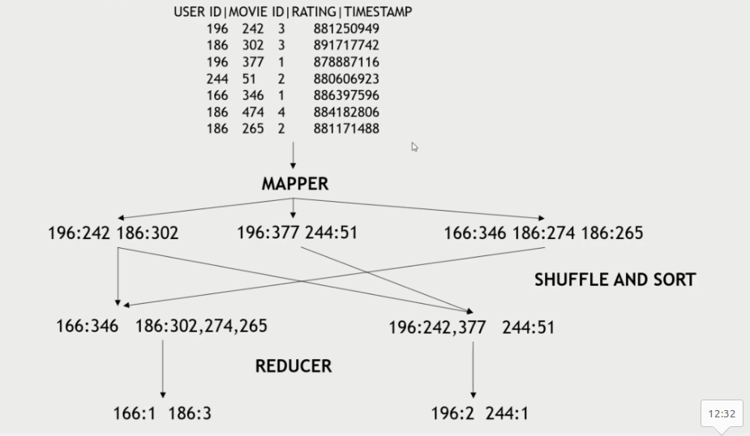
  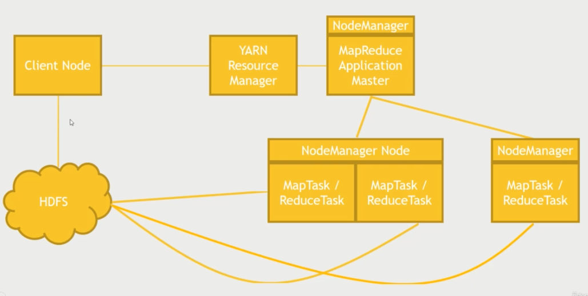


Примеры для понимания MapReduce
-----------------

Примеры расположены в кластере HDInsight в `/edx/app/hadoop/hadoop-2.7.2/share/hadoop/mapreduce/hadoop-mapreduce-examples-2.7.2.jar`. Исходный код этих примеров расположен в кластере HDInsight в `/usr/hdp/current/hadoop-client/src/hadoop-mapreduce-project/hadoop-mapreduce-examples`.

В архиве содержатся следующие примеры:

<table aria-label="Таблица 1" class="table table-sm margin-top-none">
<thead>
<tr>
<th>Образец</th>
<th>Описание</th>
</tr>
</thead>
<tbody>
<tr>
<td>aggregatewordcount</td>
<td>Подсчитывает количество слов во входных файлах.</td>
</tr>
<tr>
<td>aggregatewordhist</td>
<td>Создает гистограмму слов во входных файлах.</td>
</tr>
<tr>
<td><code>bbp</code></td>
<td>Использует формулу Бэйли-Боруэйна-Плаффа для вычисления знаков числа&nbsp;π.</td>
</tr>
<tr>
<td>dbcount</td>
<td>Подсчитывает журналы просмотра страниц, сохраненных в базе данных.</td>
</tr>
<tr>
<td>distbbp</td>
<td>Использует формулу ББП для вычисления знаков числа&nbsp;π.</td>
</tr>
<tr>
<td>grep</td>
<td>Подсчитывает совпадения регулярного выражения с входными данными.</td>
</tr>
<tr>
<td>join</td>
<td>Выполняет объединение сортированных наборов данных одного размера.</td>
</tr>
<tr>
<td>multifilewc</td>
<td>Подсчитывает слова в нескольких файлах.</td>
</tr>
<tr>
<td>pentomino</td>
<td>Программа для укладки фигур с целью поиска решений при игре в пентамино.</td>
</tr>
<tr>
<td>pi</td>
<td>Оценивает число&nbsp;π по методу квази-Монте-Карло.</td>
</tr>
<tr>
<td>randomtextwriter</td>
<td>Записывает 10 ГБ случайных текстовых данных на узел.</td>
</tr>
<tr>
<td><code>randomwriter</code></td>
<td>Записывает 10 ГБ случайных данных на узел.</td>
</tr>
<tr>
<td><code>secondarysort</code></td>
<td>Определяет вторичную сортировку для этапа редукции.</td>
</tr>
<tr>
<td>sort</td>
<td>Сортирует данные, записанные случайным образом.</td>
</tr>
<tr>
<td>sudoku</td>
<td>программа решения судоку.</td>
</tr>
<tr>
<td>teragen</td>
<td>создание данных для программы TeraSort.</td>
</tr>
<tr>
<td>terasort</td>
<td>выполнение программы TeraSort.</td>
</tr>
<tr>
<td>teravalidate</td>
<td>проверка результатов выполнения программы TeraSort.</td>
</tr>
<tr>
<td>wordcount</td>
<td>Подсчитывает количество слов во входных файлах.</td>
</tr>
<tr>
<td><code>wordmean</code></td>
<td>Подсчитывает среднюю длину слов во входных файлах.</td>
</tr>
<tr>
<td><code>wordmedian</code></td>
<td>Подсчитывает медианную длину слов во входных файлах.</td>
</tr>
<tr>
<td>wordstandarddeviation</td>
<td>Подсчитывает стандартное отклонение в длинах слов во входных файлах.</td>
</tr>
</tbody>
</table>

Запуск примера для подсчета слов
--------------------------------
шпаргалка
```
bin/hadoop fs -ls /

bin/hadoop fs -ls /data

bin/hadoop fs -ls /output/

bin/yarn jar '/edx/app/hadoop/hadoop-2.7.2/share/hadoop/mapreduce/hadoop-mapreduce-examples-2.7.2.jar' wordcount  /data/tracking.log  /output/tracking.log

bin/hadoop fs -ls /output/tracking.log/

bin/hadoop fs -cat /output/tracking.log/part-r-00000
```


1.  Подключитесь к HDInsight с помощью протокола SSH. Замените `CLUSTER` именем кластера и введите следующую команду:
    
        ssh [email protected]
        
    
2.  В сеансе SSH используйте следующую команду, чтобы вывести список примеров:
    
        yarn jar '/edx/app/hadoop/hadoop-2.7.2/share/hadoop/mapreduce/hadoop-mapreduce-examples-2.7.2.jar'
        
    
    Эта команда создает список примеров из предыдущего раздела данного документа.
    
3.  Чтобы получить справку по конкретному примеру, используйте следующую команду: В данном случае запускается пример **wordcount**.
    
         yarn jar '/edx/app/hadoop/hadoop-2.7.2/share/hadoop/mapreduce/hadoop-mapreduce-examples-2.7.2.jar' wordcount
        
    
    Отобразится следующее сообщение.
    
        Usage: wordcount <in> [<in>...] <out>
        
    
    Это сообщение означает, что можно указать несколько входных путей для исходных документов. Окончательный путь — это место, где сохраняются выходные данные (число слов в исходных документах).
    
4.  Для подсчета всех слов в книге "Записи Леонардо да Винчи", которая поставляется с кластером и служит примером исходных данных, используйте следующую команду:
    ```
    hdfs dfs -put /edx/app/hadoop/hadoop/davinci.txt /data/davinci.txt

    yarn jar '/edx/app/hadoop/hadoop-2.7.2/share/hadoop/mapreduce/hadoop-mapreduce-examples-2.7.2.jar' wordcount /data/davinci.txt /output/davinci
    ```
    
        
    
    Для этого задания считываются входные данные из файла `/example/data/gutenberg/davinci.txt`. Выходные данные для этого примера сохраняются в `/example/data/davinciwordcount`. Оба пути расположены в хранилище по умолчанию для кластера, а не в локальной файловой системе.
    
    Примечание
    
    Как сказано в справке по примеру wordcount, вы также можете указать несколько входных файлов. Например, команда `hadoop  jar '/edx/app/hadoop/hadoop-2.7.2/share/hadoop/mapreduce/hadoop-mapreduce-examples-2.7.2.jar' wordcount /example/data/gutenberg/davinci.txt /example/data/gutenberg/ulysses.txt /example/data/twowordcount` позволит подсчитать слова в файлах davinci.txt и ulysses.txt.
    
5.  По завершении задания воспользуйтесь следующей командой, чтобы просмотреть результат:
    
        hdfs dfs -cat /example/data/davinciwordcount/*
        
    
    Эта команда сцепляет все выходные файлы, созданные заданием. Она отображает выходные данные в консоли. Результат будет аналогичен приведенному ниже:
    
        zum     1
        zur     1
        zwanzig 1
        zweite  1
        
    
    Каждая строка соответствует одному слову и частоте его появления в исходных данных.
    

Пример судоку
-------------

[Судоку](https://en.wikipedia.org/wiki/Sudoku) — это логическая головоломка, которая состоит из девяти полей размером 3 x 3 клетки. Некоторые ячейки в клетках содержат числа, остальные ячейки пустые. Задача заключается в поиске чисел для пустых ячеек. С помощью указанной выше ссылки можно получить дополнительные сведения о головоломке, однако целью этого примера является поиск значений для пустых ячеек. Таким образом, на входе программы должен быть файл в следующем формате.

*   Девять строк и девять столбцов
*   Каждый столбец может содержать число или знак `?` (означает пустую ячейку).
*   Ячейки разделяются пробелами


Следующая задача — составление головоломки судоку, по правилам которой не допускается использование одного и того же числа в строке или столбце. Ниже приведен пример правильно созданного кластера HDInsight. Он находится в `https://github.com/naver/hadoop/blob/master/hadoop-mapreduce-project/hadoop-mapreduce-examples/src/main/java/org/apache/hadoop/examples/dancing/puzzle1.dta` и содержит приведенный ниже текст.

    8 5 ? 3 9 ? ? ? ?
    ? ? 2 ? ? ? ? ? ?
    ? ? 6 ? 1 ? ? ? 2
    ? ? 4 ? ? 3 ? 5 9
    ? ? 8 9 ? 1 4 ? ?
    3 2 ? 4 ? ? 8 ? ?
    9 ? ? ? 8 ? 5 ? ?
    ? ? ? ? ? ? 2 ? ?
    ? ? ? ? 4 5 ? 7 8
    
```
vladimir@server3:/edx/app/hadoop/hadoop$ hdfs dfs -put /edx/app/hadoop/hadoop/puzzle1.dta /data/puzzle1.dta

vladimir@server3:/edx/app/hadoop/hadoop$ bin/hadoop fs -ls /data
```

Чтобы обработать эти данные в примере судоку, используйте следующую команду.

    bin/yarn jar '/edx/app/hadoop/hadoop-2.7.2/share/hadoop/mapreduce/hadoop-mapreduce-examples-2.7.2.jar' sudoku /data/puzzle1.dta

    

Полученный текст должен выглядеть следующим образом.

    8 5 1 3 9 2 6 4 7
    4 3 2 6 7 8 1 9 5
    7 9 6 5 1 4 3 8 2
    6 1 4 8 2 3 7 5 9
    5 7 8 9 6 1 4 2 3
    3 2 9 4 5 7 8 1 6
    9 4 7 2 8 6 5 3 1
    1 8 5 7 3 9 2 6 4
    2 6 3 1 4 5 9 7 8
    

Пример "Пи" (π)
---------------

В примере «Пи» используется статистический метод (квази-Монте-Карло) оценки значения числа пи. Точки в произвольном порядке помещаются внутри единичного квадрата. В квадрат также вписан круг. Вероятность того, что точки находятся в круге, равна площади круга, π/4. Значение pi можно оценить на основе значения `4R`. R — это отношение количества точек, находящихся внутри круга, к общему количеству точек, находящихся внутри квадрата. Чем больше выборка используемых точек, тем точнее оценка.

Для запуска примера используйте следующую команду. Для оценки числа π в команде используется 16 карт с 10 000 000 примерами в каждой.

    bin/yarn jar '/edx/app/hadoop/hadoop-2.7.2/share/hadoop/mapreduce/hadoop-mapreduce-examples-2.7.2.jar' pi 16 10000000

    

Команда должна возвращать значение наподобие **3,14159155000000000000**. Для справки, первые 10 знаков числа пи: 3,1415926535.

Пример GraySort размером 10 ГБ
------------------------------

GraySort — это измерение производительности сортировки. Его показателем служит скорость (ТБ/мин), достигаемая при сортировке очень больших объемов данных, обычно не менее 100 ТБ.

В этом примере используется небольшой объем данных, 10 ГБ, чтобы можно было выполнить сортировку достаточно быстро. В ней используются приложения MapReduce, разработанные `Owen O'Malley` и `Arun Murthy`. Эти приложения победили в 2009 году на конкурсе приложений сортировки общего назначения (Daytona) для больших объемов данных, показав скорость 0,578 ТБ/мин (100 ТБ за 173 минуты). Дополнительные сведения об этом и других измерениях производительности сортировки см. на веб-сайте [Sort Benchmark](https://sortbenchmark.org/).

В этом примере используются три набора программ MapReduce.

*   **TeraGen**: программа MapReduce, которая создает строки с данными для последующей сортировки.
    
*   **TeraSort**: производит выборку входных данных и использует MapReduce для сортировки данных в общем порядке.
    
    TeraSort представляет собой стандартную сортировку MapReduce, за исключением настраиваемого разделителя. В разделителе используется отсортированный список выборки ключей N-1, определяющий диапазон ключей для каждой функции reduce. В частности, все ключи, подобные этому примеру \[i-1\] <= key < sample\[i\] отправляются для сокращения i. Этот разделитель гарантирует, что выходные данные reduce `i` будут меньше, чем выходные данные reduce `i+1`.
    
*   **TeraValidate**: программа MapReduce, которая проверяет глобальную сортировку выходных данных.
    
    В выходном каталоге создается одна функция map для каждого файла, и каждая функция map гарантирует, что каждый ключ будет меньше или равен предыдущему. Функция map создает записи первого и последнего ключей каждого файла. Функция reduce гарантирует, что первый ключ файла i больше последнего ключа файла i-1. Все проблемы указываются в выходных данных этапа редукции вместе с неотсортированными ключами.
    

Для создания данных, сортировки и проверки выходных данных используйте следующую команду:

1.  Создайте 10 ГБ данных, которые сохранятся в хранилище по умолчанию кластера HDInsight в `/example/data/10GB-sort-input`.
    
        yarn jar edx/app/hadoop/hadoop-2.7.2/share/hadoop/mapreduce/hadoop-mapreduce-examples-2.7.2.jar teragen -Dmapred.map.tasks=50 100000000 /example/data/10GB-sort-input
        
    
    Ключ `-Dmapred.map.tasks` говорит Hadoop о том, сколько задач сопоставления будет использоваться в этом задании. Последние два параметра означают, что задание создаст 10 ГБ данных и сохранит их в `/example/data/10GB-sort-input`.
    
2.  Выполните следующую команду, чтобы отсортировать данные:
    
        yarn jar edx/app/hadoop/hadoop-2.7.2/share/hadoop/mapreduce/hadoop-mapreduce-examples-2.7.2.jar terasort -Dmapred.map.tasks=50 -Dmapred.reduce.tasks=25 /example/data/10GB-sort-input /example/data/10GB-sort-output
        
    
    Ключ `-Dmapred.reduce.tasks` говорит Hadoop о том, сколько задач сокращения будет использоваться в этом задании. Последние два параметра соответствуют путям расположения входных и выходных данных.
    
3.  Используйте следующую команду, чтобы просмотреть отсортированные данные:
    
        yarn jar edx/app/hadoop/hadoop-2.7.2/share/hadoop/mapreduce/hadoop-mapreduce-examples-2.7.2.jar teravalidate -Dmapred.map.tasks=50 -Dmapred.reduce.tasks=25 /example/data/10GB-sort-output /example/data/10GB-sort-validate
        
    
____


# Зтап 2  - MapReduce в Hadoop через python 
---------------

Map - Reduce

   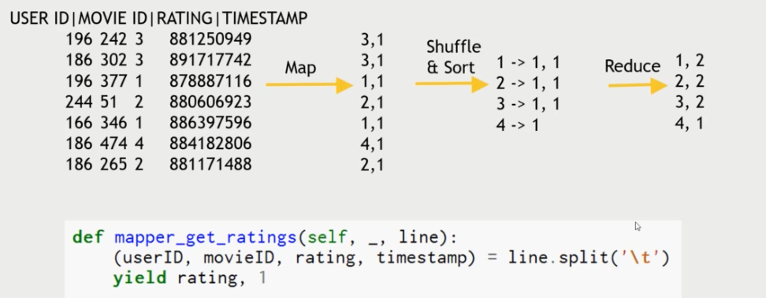


# MRJob

 Алгоритм сортировки:


```py
from mrjob.job import MRJob
from mrjob.step import MRStep

class RatingsBreakdown(MRJob):
    def steps(self):
        return [
            MRStep(mapper=self.mapper_get_ratings,
                   reducer=self.reducer_count_ratings),
            MRStep(reducer=self.reducer_sorted_output)
        ]

    def mapper_get_ratings(self, _, line):
        (userID, movieID, rating, timestamp) = line.split('\t')
        yield movieID, 1

    def reducer_count_ratings(self, key, values):
        yield str(sum(values)).zfill(5), key

    def reducer_sorted_output(self, count, movies):
        for movie in movies:
            yield movie, count


if __name__ == '__main__':
    RatingsBreakdown.run()
```


Запуск локально и в экосистеме Hadoop в потоковой обработке  

 


[Примеры ML- алгоритмов](https://github.com/selfedu-rus/machine_learning)

# Spark


Запустим spark

```
cd /edx/app/hadoop/spark

sbin/start-all.sh

jps
```


Запустим те же примеры, что были выше но используя Python

```
hdfs dfs -mkdir /log

bin/spark-submit --master local /edx/app/hadoop/spark/examples/src/main/python/pi.py

bin/spark-submit --master local /edx/app/hadoop/spark/examples/src/main/python/wordcount.py /data/tracking.log
```


# Luigi pipelines


[repo](https://github.com/VladimirAndropov/repo)

# Что такое machine learning pipeline?

конвеер машинного обучения - это серия взаимосвязанных этапов обработки данных и моделирования, предназначенных для автоматизации, стандартизации и упрощения процесса создания, обучения, оценки и развертывания моделей машинного обучения.

конвеер машинного обучения является важным компонентом в разработке и производстве систем [машинного обучения](https://www.ibm.com/topics/machine-learning), помогая [ученым-ученым](https://www.ibm.com/Themics/DataScience) и инженеры по данным управляют сложностью процесса сквозного машинного обучения и помогают им разработать точные и масштабируемые решения для широкого спектра приложений.

----

## Run pipeline
```

cd /edx/app/hadoop

rm repo

git clone https://github.com/VladimirAndropov/repo

```
## настраиваем Luigi
```

sudo apt-get install python3-virtualenv libffi-dev python2-dbg python2-dev python2.7-dbg python2.7-dev

sudo apt install python2-setuptools-whl

sudo apt install python2-pip-whl

virtualenv --python=/usr/bin/python2.7 pipeline

source pipeline/bin/activate

cd repo


python -m pip install --upgrade pip

python -m  pip install -r requirements/base.txt

python -m pip install -r requirements/default.txt

python setup.py install
```
запускаем luigi
```
luigid & 
```
откройте страницу по адресу
http://server3:8082/


открываем другую консоль (terminal)
```
cd /edx/app/hadoop
source pipeline/bin/activate
cd repo
```
запускаем class ModuleEngagementWorkflowTask который анализирует логи из файлов в папке data/tracking.log
``` 
launch-task ModuleEngagementWorkflowTask \
--date $(date +%Y-%m-%d -d "2021-12-12") \
--indexing-tasks 5 \
--throttle 0.5 \
--n-reduce-tasks 1
```
запускаем класс который анализирует данные из Mysql кто когда зарегистрировался и из какого города с какого айпи и тп

нужно установить 
```
sudo apt install mysql-server mysql-client libmysqlclient-dev 
```
и пакет в окружении pipeline
```
pip install mysql-connector-python==8.0.15
```
и заполнить БД тестовыми данными
https://drive.google.com/file/d/1W4WPkHb9xRlbgsJMws9zDkd7IYa_UZOK/view?usp=sharing
https://drive.google.com/file/d/1XWElIfB7nti_6hvctZPEQ2g9izqvFgSL/view?usp=sharing
https://drive.google.com/file/d/124dtvIdgH9kUBzRHMbRH88aK7gDz0Exx/view?usp=sharing
https://drive.google.com/file/d/1pt-DpKSXENSv0RADucjKSrZ_lJ7Mw7Io/view?usp=sharing
https://drive.google.com/file/d/1XgjvIXhEYdA8tVDdNG24UHZx1V_J83bd/view?usp=sharing


```
launch-task ImportEnrollmentsIntoMysql --local-scheduler \
  --interval 2015-01-01-2023-12-12 \
  --n-reduce-tasks 1 \
  --overwrite-mysql \
  --overwrite-hive  --overwrite-n-days 365


 launch-task UserActivityTask  --interval 2015-01-01-2024-01-01   --n-reduce-tasks 1
```
Если всё получилось, выполняемые task отобразятся в luigi

 

# Рабочие примеры на живом сервере hadoop

edx.analytics.tasks =

    # common
    sqoop-import = edx.analytics.tasks.common.sqoop:SqoopImportFromMysql
    insert-into-table = edx.analytics.tasks.common.mysql_load:MysqlInsertTask
    bigquery-load = edx.analytics.tasks.common.bigquery_load:BigQueryLoadTask

    # insights
    answer-dist = edx.analytics.tasks.insights.answer_dist:AnswerDistributionPerCourse
    calendar = edx.analytics.tasks.insights.calendar_task:CalendarTableTask
    course_blocks = edx.analytics.tasks.insights.course_blocks:CourseBlocksApiDataTask
    course_list = edx.analytics.tasks.insights.course_list:CourseListApiDataTask
    database-import = edx.analytics.tasks.insights.database_imports:ImportAllDatabaseTablesTask
    engagement = edx.analytics.tasks.insights.module_engagement:ModuleEngagementDataTask
    enrollments = edx.analytics.tasks.insights.enrollments:ImportEnrollmentsIntoMysql
    location-per-course = edx.analytics.tasks.insights.location_per_course:LastCountryOfUser
    problem_response = edx.analytics.tasks.insights.problem_response:LatestProblemResponseDataTask
    tags-dist = edx.analytics.tasks.insights.tags_dist:TagsDistributionPerCourse
    user-activity = edx.analytics.tasks.insights.user_activity:InsertToMysqlCourseActivityTask
    video = edx.analytics.tasks.insights.video:InsertToMysqlAllVideoTask

    # data_api
    grade-dist = edx.analytics.tasks.data_api.studentmodule_dist:GradeDistFromSqoopToMySQLWorkflow
    student_engagement = edx.analytics.tasks.data_api.student_engagement:StudentEngagementTask

    # warehouse:
    event-type-dist = edx.analytics.tasks.warehouse.event_type_dist:PushToVerticaEventTypeDistributionTask
    load-course-catalog = edx.analytics.tasks.warehouse.load_internal_reporting_course_catalog:PullDiscoveryCoursesAPIData
    load-d-certificates = edx.analytics.tasks.warehouse.load_internal_reporting_certificates:LoadInternalReportingCertificatesToWarehouse
    load-d-country = edx.analytics.tasks.warehouse.load_internal_reporting_country:LoadInternalReportingCountryToWarehouse
    load-d-user = edx.analytics.tasks.warehouse.load_internal_reporting_user:LoadInternalReportingUserToWarehouse
    load-d-user-course = edx.analytics.tasks.warehouse.load_internal_reporting_user_course:LoadUserCourseSummary
    load-events = edx.analytics.tasks.warehouse.load_internal_reporting_events:TrackingEventRecordDataTask
    load-f-user-activity = edx.analytics.tasks.warehouse.load_internal_reporting_user_activity:LoadInternalReportingUserActivityToWarehouse
    load-internal-database = edx.analytics.tasks.warehouse.load_internal_reporting_database:ImportMysqlToVerticaTask
    load-internal-active-users = edx.analytics.tasks.warehouse.load_internal_reporting_active_users:LoadInternalReportingActiveUsersToWarehouse
    load-warehouse = edx.analytics.tasks.warehouse.load_warehouse:LoadWarehouseWorkflow
    load-warehouse-bigquery=edx.analytics.tasks.warehouse.load_warehouse_bigquery:LoadWarehouseBigQueryTask
    push_to_vertica_lms_courseware_link_clicked = edx.analytics.tasks.warehouse.lms_courseware_link_clicked:PushToVerticaLMSCoursewareLinkClickedTask
    run-vertica-sql-script = edx.analytics.tasks.warehouse.run_vertica_sql_script:RunVerticaSqlScriptTask
    run-vertica-sql-scripts = edx.analytics.tasks.warehouse.run_vertica_sql_scripts:RunVerticaSqlScriptTask
    test-vertica-sqoop = edx.analytics.tasks.common.vertica_export:VerticaSchemaToBigQueryTask

    # financial:
    cybersource = edx.analytics.tasks.warehouse.financial.cybersource:DailyPullFromCybersourceTask
    ed_services_report = edx.analytics.tasks.warehouse.financial.ed_services_financial_report:BuildEdServicesReportTask
    financial_reports  = edx.analytics.tasks.warehouse.financial.finance_reports:BuildFinancialReportsTask
    orders = edx.analytics.tasks.warehouse.financial.orders_import:OrderTableTask
    payment_reconcile = edx.analytics.tasks.warehouse.financial.reconcile:ReconcileOrdersAndTransactionsTask
    paypal = edx.analytics.tasks.warehouse.financial.paypal:PaypalTransactionsByDayTask

    # export:
    data_obfuscation   = edx.analytics.tasks.export.data_obfuscation:ObfuscatedCourseDumpTask
    dump-student-module = edx.analytics.tasks.export.database_exports:StudentModulePerCourseTask
    events_obfuscation = edx.analytics.tasks.export.events_obfuscation:ObfuscateCourseEventsTask
    export-events = edx.analytics.tasks.export.event_exports:EventExportTask
    export-events-by-course = edx.analytics.tasks.export.event_exports_by_course:EventExportByCourseTask
    export-student-module = edx.analytics.tasks.export.database_exports:StudentModulePerCourseAfterImportWorkflow
    obfuscation = edx.analytics.tasks.export.obfuscation:ObfuscatedCourseTask

    # monitor:
    all_events_report = edx.analytics.tasks.monitor.total_events_report:TotalEventsReportWorkflow
    enrollment_validation = edx.analytics.tasks.monitor.enrollment_validation:CourseEnrollmentValidationTask
    overall_events = edx.analytics.tasks.monitor.overall_events:TotalEventsDailyTask
    noop = edx.analytics.tasks.monitor.performance:ParseEventLogPerformanceTask

    # enterprise:
    enterprise_enrollments = edx.analytics.tasks.enterprise.enterprise_enrollments:ImportEnterpriseEnrollmentsIntoMysql

usage: launch-task
___

```
SqoopImportFromMysql(destination=hdfs://server:9000/edx-analytics-pipeline/warehouse/, credentials=/edx/etc/edx-analytics-pipeline/input.json, database=edxapp, where=None, table_name=auth_userprofile, columns=[], null_string=None, fields_terminated_by=None, delimiter_replacement=None, mysql_delimiters=True
```

```
SqoopImportFromMysql(destination=hdfs://server:9000/edx-analytics-pipeline/warehouse/auth_userprofile/dt=2023-02-27/, credentials=/edx/etc/edx-analytics-pipeline/input.json, database=edxapp, where=None, table_name=auth_userprofile, columns=["user_id", "name", "gender", "year_of_birth", "level_of_education", "language", "location", "mailing_address", "city", "country", "goals"], null_string=\\N, fields_terminated_by=, delimiter_replacement= , mysql_delimiters=False)
```

**************enrolments*****************
--
```
launch-task ImportEnrollmentsIntoMysql --local-scheduler \
  --interval 2018-01-01-2018-12-12 \
  --n-reduce-tasks 1 \
  --overwrite-mysql \
  --overwrite-hive  --overwrite-n-days 365
```
```
remote-task --host insights --user vladimir --private-key /home/vladimir/yandex-fa.pem --remote-name analyticstack --skip-setup --wait   
ModuleEngagementWorkflowTask \
--date $(date +%Y-%m-%d -d "2021-12-12") \
--indexing-tasks 5 \
--throttle 0.5 \
--n-reduce-tasks 1
--local-scheduler
```

**********geog****
_____
```
remote-task --host server3 --user vladimir --private-key /home/vladimir/yandex-fa.pem --remote-name analyticstack --skip-setup --wait InsertToMysqlLastCountryPerCourseTask --local-scheduler \
  --interval 2020-01-01-2020-09-09 \
  --n-reduce-tasks 1 \
  --overwrite-mysql \
  --overwrite-hive  --overwrite-n-days 15  --course-country-output hdfs://localhost:9000/tmp/2020-09-06/user/country_course 
```
```
remote-task --host insights --user vladimir --private-key /home/vladimir/yandex-fa.pem --remote-name analyticstack --skip-setup --wait  \
 --local-scheduler  CourseListApiDataTask   --output-root hdfs://localhost:9000/output/
```

```
remote-task --host insights --user vladimir --private-key /home/vladimir/yandex-fa.pem --remote-name analyticstack --skip-setup --wait  --local-scheduler   \
LastCountryOfUser   --interval 2022-01-01-2022-12-12 \
  --n-reduce-tasks 1 \
  --overwrite-n-days 365
```

```
InsertToMysqlLastCountryPerCourseTask --local-scheduler \
 --interval $(date +%Y-%m-%d -d "$FROM_DATE")-$(date +%Y-%m-%d -d "$TO_DATE") \
 --course-country-output $INTERMEDIATE_OUTPUT_ROOT/$(date +%Y-%m-%d -d "$TO_DATE")/country_course \
 --n-reduce-tasks $NUM_REDUCE_TASKS \
 --overwrite
 ```

 *********engagement**************
 _____

 ```
remote-task --host server3 --user vladimir --private-key /home/vladimir/yandex-fa.pem --remote-name analyticstack --skip-setup --wait  InsertToMysqlCourseActivityTask --local-scheduler   --end-date 2020-09-09   --weeks 24   --overwrite-mysql --overwrite-n-days 7
```

```
 InsertToMysqlCourseActivityTask --local-scheduler \
  --end-date $(date +%Y-%m-%d -d "$TO_DATE") \
  --weeks 24 \
  --credentials $CREDENTIALS \
  --n-reduce-tasks $NUM_REDUCE_TASKS \
  --overwrite-n-days 169
  ```

  ******************4tesk def*************
  _____

```  
remote-task --host localhost --repo https://github.com/edx/edx-analytics-pipeline --user ubuntu --override-config $HOME/edx-analytics-pipeline/config/devstack.cfg --wheel-url http://edx-wheelhouse.s3-website-us-east-1.amazonaws.com/Ubuntu/precise --remote-name analyticstack --wait TotalEventsDailyTask --interval 2016-08-13-2016-10-24 --output-root hdfs://localhost:9000/output/ --local-scheduler 
```

```
remote-task --host localhost --user ubuntu --remote-name analyticstack --skip-setup --wait CourseEnrollmentEventsTask --local-scheduler   --interval 2016-08-13-2016-10-24   --n-reduce-tasks 1
```

```
remote-task --host localhost --user ubuntu --remote-name analyticstack --skip-setup --wait ImportEnrollmentsIntoMysql --interval 2016-10-21-2016-10-22 --local-scheduler --overwrite-n-days 1
```

```
remote-task --host localhost --user ubuntu --remote-name analyticstack --skip-setup --wait CourseEnrollmentEventsTask --local-scheduler   --interval 2016-08-13-2016-10-24   --n-reduce-tasks 1
```
 
```
remote-task --host server3 --user vladimir --private-key /home/vladimir/yandex-fa.pem --remote-name analyticstack --skip-setup --wait InsertToMysqlLastCountryPerCourseTask --local-scheduler --interval 2020-01-01-2020-09-09 --overwrite-n-days 15
```

```
remote-task --host server3 --user vladimir --private-key /home/vladimir/yandex-fa.pem --remote-name analyticstack --skip-setup --wait LastDailyIpAddressOfUserTask --local-scheduler    --interval 2020-01-01-2020-09-06 
```

```
remote-task --host server3 --user vladimir --private-key /home/vladimir/yandex-fa.pem --remote-name analyticstack --skip-setup --wait  InsertToMysqlCourseActivityTask --local-scheduler   --end-date 2020-09-06   --weeks 24   --overwrite-mysql --overwrite-n-days 15
```

```
remote-task --host server3 --user vladimir --private-key /home/vladimir/yandex-fa.pem --remote-name analyticstack --skip-setup --wait  InsertToMysqlLastCountryPerCourseTask --local-scheduler --interval 2016-09-01-2020-09-06 --user-country-output hdfs://localhost:9000/tmp/2020-09-06/user_location --course-country-output hdfs://localhost:9000/tmp/2020-09-06/user/country_course --n-reduce-tasks 1 --overwrite --credentials /edx/etc/edx-analytics-pipeline/input.json
```

```
/edx/app/hadoop/hadoop/bin/hdfs dfs -put -f /edx/var/log/tracking/tracking.log hdfs://server3:9000/data/tracking.log
```
```
hdfs dfs -ls /data
```

```
/edx/app/hadoop/hadoop/bin/hadoop
 jar /edx/app/hadoop/hadoop/share/hadoop/tools/lib/hadoop-streaming-2.7.2.jar
 -D "mapred.job.name=CourseListApiDataTask(warehouse_path=hdfs://server3:9000/edx-analytics-pipeline/warehouse/,
 datetime=2023-01-21T160149, 
partition_format=%Y-%m-%d, 
output_root=hdfs://server3:9000/course_lists/)" -D 
mapred.reduce.tasks=25 -D 
stream.jobconf.truncate.limit=20000
 -mapper "/usr/bin/python2.7 mrrunner.py map" 
-reducer "/usr/bin/python2.7 mrrunner.py reduce"
 -file /var/lib/analytics-tasks/analyticstack/venv/src/luigi/luigi/contrib/mrrunner.py
 -file /tmp/tmpm2NbMK/packages.tar
 -file /tmp/tmpm2NbMK/job-instance.pickle
 -input hdfs://server3:9000/edx-analytics-pipeline/warehouse/course_list_raw/dt=2023-01-21/course_list.json
 -output hdfs://server3:9000/course_lists
```

```
 launch-task ImportEnrollmentsIntoMysql --local-scheduler --interval 2023-01-01-2023-01-06 --n-reduce-tasks 1 --overwrite-mysql --overwrite-hive --overwrite-n-days 2'"
```
```
 launch-task CourseTableTask  --local-scheduler (warehouse_path=hdfs://localhost:9000/edx-analytics-pipeline/warehouse/)
```

```
remote-task --host server3 --user hadoop --remote-name analyticstack --skip-setup --wait CourseTableTask
```

```
 launch-task  SqoopImportFromMysql  --local-scheduler 
 launch-task  CourseEnrollmentEventsTask --local-scheduler   --interval 2016-08-13-2016-10-24   --n-reduce-tasks 1
```

```
launch-task CourseMetaSummaryEnrollmentDataTask  --interval 2016-10-21-2016-10-22  --overwrite-n-days 2   --local-scheduler 
source=["hdfs://localhost:9000/data/"] expand_interval=0 w 2 d 0 h 0 m 0 s, pattern=[".*tracking.log.*"], date_pattern=%Y%m%d, warehouse_path=hdfs://localhost:9000/edx-analytics-pipeline/warehouse/, date=2023-01-13, partner_short_codes=[], partner_api_urls=[], api_root_url=None,
, enable_course_catalog=False)
```

```
remote-task --host server3 --user vladimir --private-key /home/vladimir/yandex-fa.pem --remote-name analyticstack --skip-setup --wait \ 
AnswerDistributionWorkflow --local-scheduler \
--src hdfs://localhost:9000/data \
--dest  hdfs://localhost:9000/edx-analytics-pipeline \
--name hadoop  --output-root hdfs://localhost:9000/output/ \
--include 'tracking.log.gz'  \
--manifest hdfs://localhost:9000/data/manifest.txt  \
--base-input-format "org.edx.hadoop.input.ManifestTextInputFormat" \
 --lib-jar "hdfs://localhost:9000/edx-analytics-pipeline/packages/edx-analytics-hadoop-util.jar" --n-reduce-tasks 1 \
--marker hdfs://localhost:9000/edx-analytics-pipeline/marker/  \
--credentials "/edx/etc/edx-analytics-pipeline/output.json"
```

```
ModuleEngagementWorkflowTask \
--date $(date +%Y-%m-%d -d "2021-04-28") \
--indexing-tasks 5 \
--throttle 0.5 \
--n-reduce-tasks 1
```

```
CourseActivityWeeklyTask   --local-scheduler   --end-date $(date +%Y-%m-%d -d "$TO_DATE")   --weeks 24   --n-reduce-tasks 1   --skip-setup
```

```
remote-task --host server3 --user vladimir --private-key /home/vladimir/yandex-fa.pem --remote-name analyticstack --skip-setup --wait  CourseActivityWeeklyTask --local-scheduler \
  --end-date $(date +%Y-%m-%d -d "today") \
  --weeks 24 \
  --credentials /edx/etc/edx-analytics-pipeline/input.json \
  --n-reduce-tasks 1
```

```
remote-task --host server3 --branch open-release/hawthorn.master --repo https://github.com/edx/edx-analytics-pipeline --user hadoop  --override-config /edx/app/edx-analytics-pipeline/edx-analytics-pipeline/config/devstack.cfg --wheel-url http://edx-wheelhouse.s3-website-us-east-1.amazonaws.com/Ubuntu/precise --remote-name analyticstack --wait TotalEventsDailyTask --interval 2020-08-14-2020-08-29  --output-root hdfs://localhost:9000/output/  --local-scheduler
```

```
remote-task --host server3 --user vladimir --private-key /home/vladimir/yandex-fa.pem --remote-name analyticstack --skip-setup --wait ImportEnrollmentsIntoMysql --interval 2020-01-01-2020-08-29 --local-scheduler --local-scheduler --overwrite-n-days 15 --verbose
```

```
cd /var/lib/analytics-tasks/analyticstack/venv/share/edx.analytics.tasks/
/var/lib/analytics-tasks/analyticstack/venv/bin/ansible-playbook  -vvv -i server3, -c local  /var/lib/analytics-tasks/analyticstack/venv/share/edx.analytics.tasks/task.yml  -e pipeline_repo_dir_name=repo -e item.url=https://github.com/openedx/edx-analytics-pipeline.git  -e item.dir_name= repo -e item.branch=master  -e  name=all  -e  branch=open-release/hawthorn.master   -e  write_luigi_config=false  -e  root_log_dir=/var/log/analytics-tasks  -e  root_data_dir=/var/lib/analytics-tasks  -e  override_config=/edx/app/edx-analytics-pipeline/edx-analytics-pipeline/config/devstack.cfg  -e  uuid=analyticstack -e repo.url=https://github.com/edx/edx-analytics-pipeline.git
```

Этап 3  MapReduce в Hadoop через запросы БД NoSQL
--------------------------------

Условие: распределенные по нескольким серверам данные

# HBASE

БД колоночного типа:

 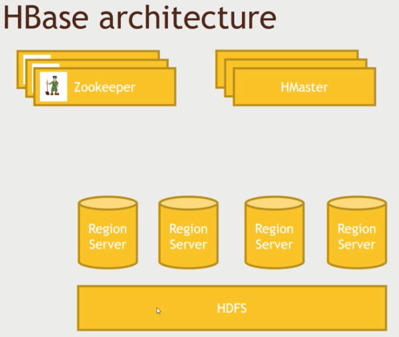
  
 


Загружаем тестовые данные из файла /user/maria_dev/ml-100k/u.user в HBASE
используя утилиту pig

Этот механизм по сути и есть Map-reduce

```bash

users = LOAD '/user/maria_dev/ml-100k/u.user' 
USING PigStorage('|') 
AS (userID:int, age:int, gender:chararray, occupation:chararray, zip:int);

STORE users INTO 'hbase://users' 
USING org.apache.pig.backend.hadoop.hbase.HBaseStorage (
'userinfo:age,userinfo:gender,userinfo:occupation,userinfo:zip');

```
## Python-скрипт для работы с HBase в Hadoop

Напишем небольшой код для понимания процедуры заполнения данными БД колоночного типа. 
Каждому юзеру мы сопостовляем семейство колоночных таблиц, где у нас будут результаты его оценок каждого фильма

Архитектура приложения

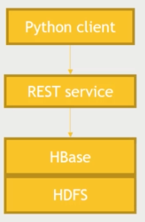

```py
from starbase import Connection

# Establish connection to HBase REST server
c = Connection("127.0.0.1", "8000")

# Get reference to 'ratings' table
ratings = c.table('ratings')

# If table exists, drop it
if ratings.exists():
    print("Dropping existing ratings table\n")
    ratings.drop()

# Create new table with 'rating' column family
ratings.create('rating')

print("Parsing the ml-100k ratings data...\n")

# Open MovieLens dataset
ratingFile = open("e:/Downloads/ml-100k/ml-100k/u.data", "r")

# Здесь можно использовать файл на hdfs через Spark
#ratingFile = spark.sparkContext.textFile("hdfs:///user/maria_dev/ml-100k/u.user")

# Create batch for bulk loading
batch = ratings.batch()

# Process each rating
for line in ratingFile:
    (userID, movieID, rating, timestamp) = line.split()
    batch.update(userID, {'rating': {movieID: rating}})

ratingFile.close()

print("Committing ratings data to HBase via REST service\n")
batch.commit(finalize=True)

# Retrieve and display ratings for specific users
print("Get back ratings for some users...\n")

# Get ratings for user ID 1
print("Ratings for user ID 1:\n")
print(ratings.fetch("1"))

# Get ratings for user ID 33
print("Ratings for user ID 33:\n")
print(ratings.fetch("33"))

ratings.drop()

```

Запускаем скрипт через Canopy

```bash
/usr/hdp/current/hbase-master/bin/hbase-daemon.sh start rest -p 8000 --infoport 8001

```


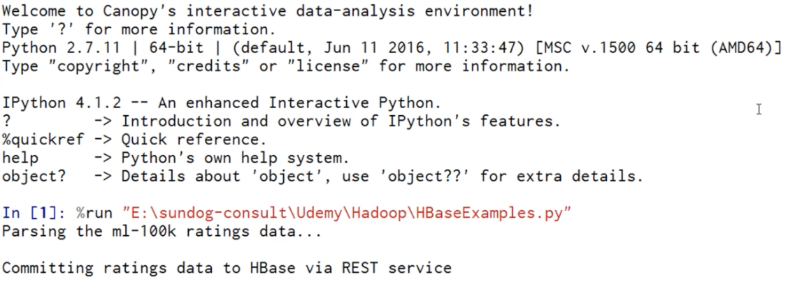


Варианты запуска скрипта

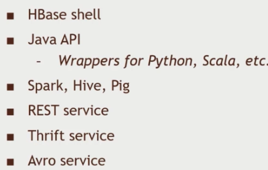

Останавливаем Canopy

```bash
 /usr/hdp/current/hbase-master/bin/hbase-daemon.sh stop rest

```

[HBase -примеры запросов к БД](https://github.com/VladimirAndropov/fa-nosql-practice/hbase/apache-phoenix_queries.sql)

## JAVA-приложение работы с HBase в Hadoop

[HBase - JAVA-приложение](https://github.com/VladimirAndropov/fa-nosql-practice/hbase/movielens-hbase/)

# MONGO

Архитектура приложения использующего Mongo для доступа к распределенным данным hdfs

 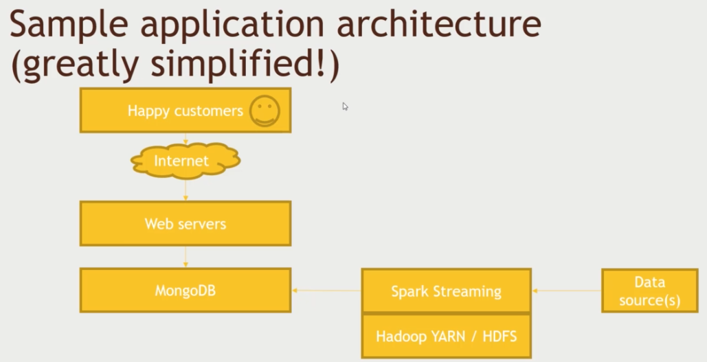

Приложение должно иметь параметры "откуда брать данные"  и "куда сохранять результат" 
Данные должны быть денормализованы.

Шардинг

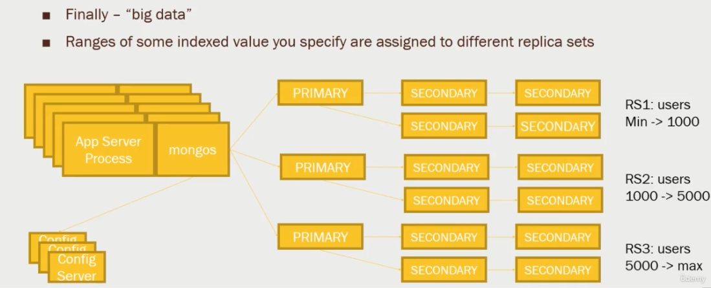

[Mongo - примеры запросов к БД - создать индекс](https://github.com/VladimirAndropov/fa-nosql-practice/mongodb/indexes.js)

[Mongo -  Map-Reduce](https://github.com/VladimirAndropov/fa-nosql-practice/mongodb/analytical_queries/movie_genre_count_per_year_using_mapreduce.js)

```java
db.movies.mapReduce(mapFn, reduceFn, {out: {inline: 1}, query: {}}) //outputs to screen

var mapFn = function(){
	var genres = this.genres;
	var year = this.release_year;
	//emit each genre as count 1
	for (var i = 0; i < genres.length; i++)
		emit({'year': year, 'genre': genres[i]}, 1);
}

var reduceFn = function(key, values) {
	return Array.sum(values);
}
```
PS: вместо hdfs используеся GridFs


пример на Python (MongoSpark.py)
```py
from pyspark.sql import SparkSession
from pyspark.sql import Row
from pyspark.sql import functions

def parseInput(line):
    fields = line.split('|')
    return Row(user_id = int(fields[0]), age = int(fields[1]), gender = fields[2], occupation = fields[3], zip = fields[4])

if __name__ == "__main__":
    # Create a SparkSession
    spark = SparkSession.builder.appName("MongoDBIntegration").getOrCreate()

    # Get the raw data
    lines = spark.sparkContext.textFile("hdfs:///user/maria_dev/ml-100k/u.user")
    # Convert it to a RDD of Row objects with (userID, age, gender, occupation, zip)
    users = lines.map(parseInput)
    # Convert that to a DataFrame
    usersDataset = spark.createDataFrame(users)

    # Write it into MongoDB
    usersDataset.write\
        .format("com.mongodb.spark.sql.DefaultSource")\
        .option("uri","mongodb://127.0.0.1/movielens.users")\
        .mode('append')\
        .save()

    # Read it back from MongoDB into a new Dataframe
    readUsers = spark.read\
    .format("com.mongodb.spark.sql.DefaultSource")\
    .option("uri","mongodb://127.0.0.1/movielens.users")\
    .load()

    readUsers.createOrReplaceTempView("users")

    sqlDF = spark.sql("SELECT * FROM users WHERE age < 20")
    sqlDF.show()

    # Stop the session
    spark.stop()
```

Итак, для работы с Mongo в экосстеме Hadoop нам потребуется Spark

Запускаем Spark

```bash
/edx/app/hadoop/spark/sbin/start-all.sh
```
Теперь чтобы запустить python- скрипт MongoSpark.py в Spark

```
/edx/app/hadoop/spark/bin/spark-submit MongoSpark.py
```

[ Mongo - шаблон JAVA-приложение](https://github.com/VladimirAndropov/fa-nosql-practice/mongodb/mysql2mongodb/)

JAVA-приложение запускается аналогично


```
spark-submit \
  --class com.example.MySparkApp \
  --master local[4] \
  /path/to/your-application.jar


```


## Итоговые приложения, разработанные со студентами на семинарах


[Семинар 19/03/2025 Mongo - JAVA-приложение](https://github.com/VladimirAndropov/mysql2mongodb)

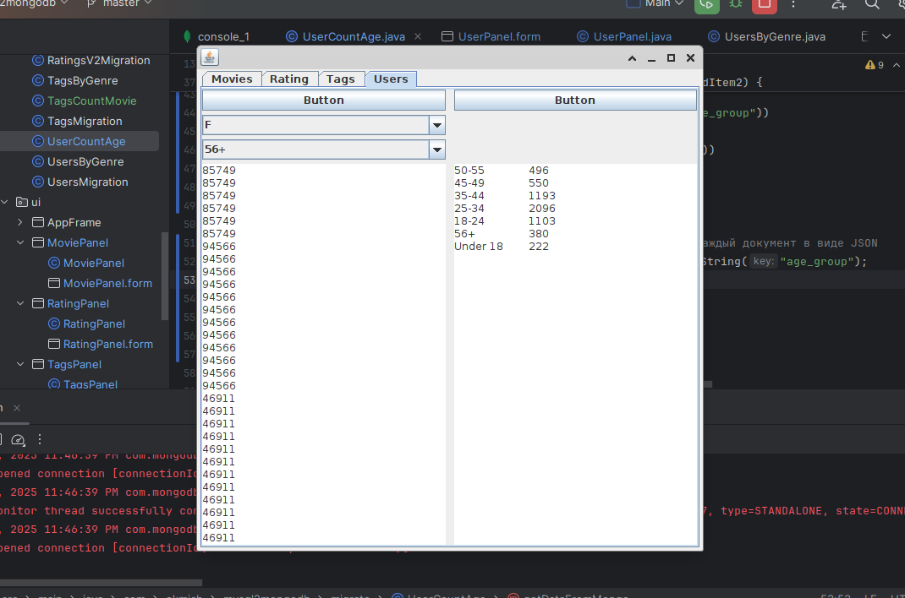
 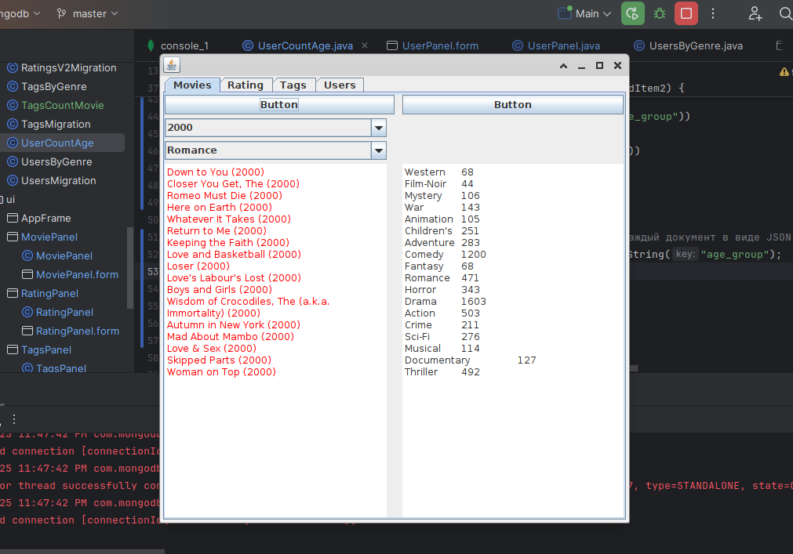
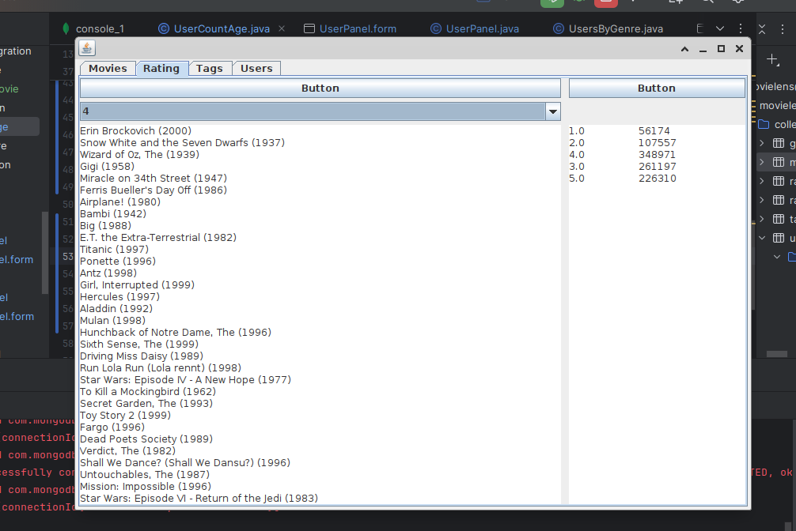
 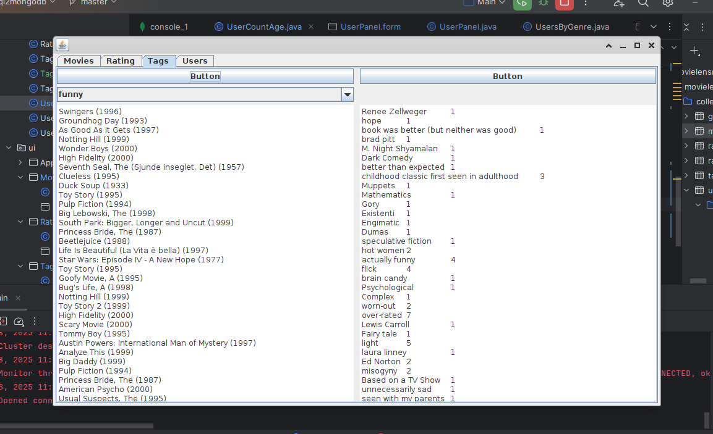


# REDIS

Интеграция с Hadoop через Spark

```py
# Assume 'df' is your DataFrame
# Write DataFrame to Redis
df.write.format("org.apache.spark.sql.redis").option("table", "your_table").option("key.column", "your_key_column").save()
```

```py
# Read DataFrame from Redis
spark.read.format("org.apache.spark.sql.redis").option("table", "your_table").option("key.column", "your_key_column").load()

```

[Redis -примеры запросов к БД](https://github.com/VladimirAndropov/fa-nosql-practice/redis/data-structure-commands/)

[Redis - шаблон JAVA-приложение](https://github.com/VladimirAndropov/movielens-redis-ui)


## Итоговые приложения, разработанные со студентами на семинарах

[Семинар 05/03/2025 Redis - JAVA-приложение](https://github.com/VladimirAndropov/movielens-redis-ui)

 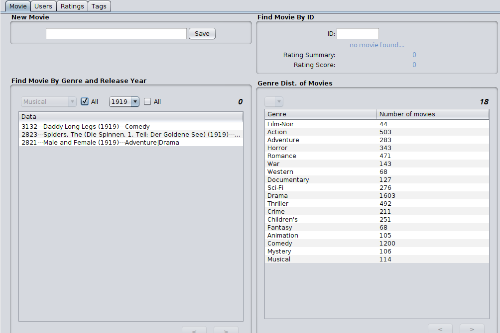
  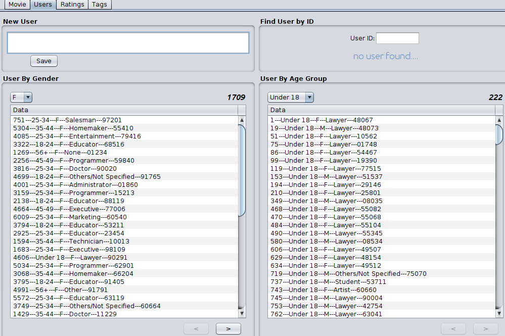
   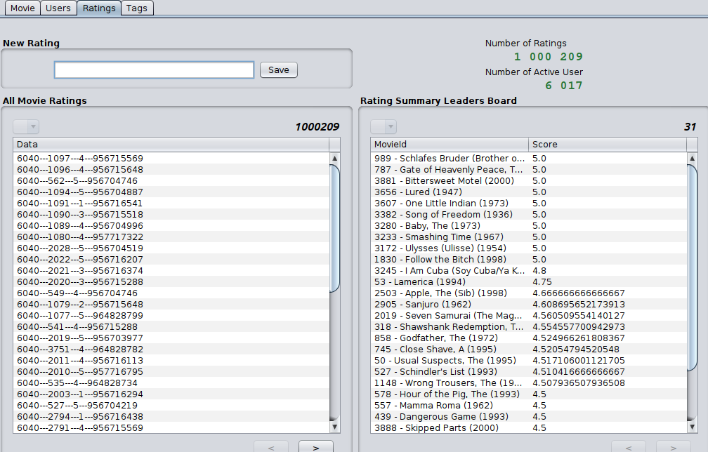
    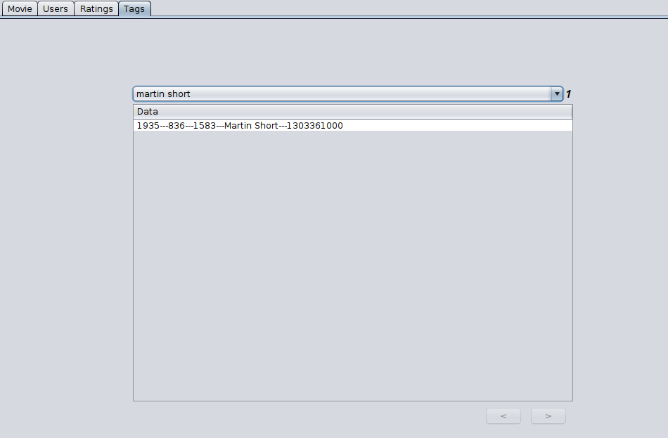


# ELASTICSEARCH

Мои дефолтные параметры для доступа
```
user = admin
 password = Opensearch1!

``` 


- ##  интеграция с Hadoop:

```
$ bin/hadoop jar myJar.jar -libjars elasticsearch-hadoop.jar
```
Подробнее смотрите по ссылке
https://www.elastic.co/guide/en/elasticsearch/hadoop/8.18/mapreduce.html

- ## интеграция через Spark

```
$ ./bin/spark-submit --conf spark.es.resource=index/type ... 
```

- ## java

При использовании Java  есть выделенный класс, который обеспечивает аналогичную функцию для Esspark, а именно JavaEsSpark в библиотеке org.elasticsearch.spark.rdd.api.java (пакет, аналогичный Java API Spark):

```java

import org.apache.spark.api.java.JavaSparkContext;                              
import org.apache.spark.api.java.JavaRDD;
import org.apache.spark.SparkConf;

import org.elasticsearch.spark.rdd.api.java.JavaEsSpark;                        
...

SparkConf conf = ...
JavaSparkContext jsc = new JavaSparkContext(conf);                              

Map<String, ?> numbers = ImmutableMap.of("one", 1, "two", 2);                   
Map<String, ?> airports = ImmutableMap.of("OTP", "Otopeni", "SFO", "San Fran");

JavaRDD<Map<String, ?>> javaRDD = jsc.parallelize(ImmutableList.of(numbers, airports));
JavaEsSpark.saveToEs(javaRDD, "spark/docs");                                    
```

[Elasticsearch -примеры запросов к БД](https://github.com/VladimirAndropov/fa-nosql-practice/elasticsearch/movielens/movielens_query.json)

[Opensearch - JAVA-приложение](https://github.com/VladimirAndropov/fa-nosql-practice/elasticsearch/movielens/movielens-es/)

## Итоговые приложения, разработанные со студентами на семинарах

[Семинар 09/04/2025 Opensearch - REST API](https://github.com/VladimirAndropov/fa-nosql-practice/elasticsearch/elasticsearchRESTAPI.json)

[Семинар 09/04/2025 Opensearch - JAVA-приложение](https://github.com/VladimirAndropov/movielens-es)

________________

# Витрины-OLAP:

## NEO4J

[neo4j -примеры запросов к БД](https://github.com/VladimirAndropov/fa-nosql-practice/neo4j/scripts/)

[neo4j - JAVA-приложение](https://github.com/VladimirAndropov/fa-nosql-practice/neo4j/movielens-neo4j/)

# Кроссплатфорmенные приложения (шаблоны):

[Flutter](https://github.com/VladimirAndropov/fa-cross-practice)
[React Native](https://github.com/VladimirAndropov/fa-cross-practice)